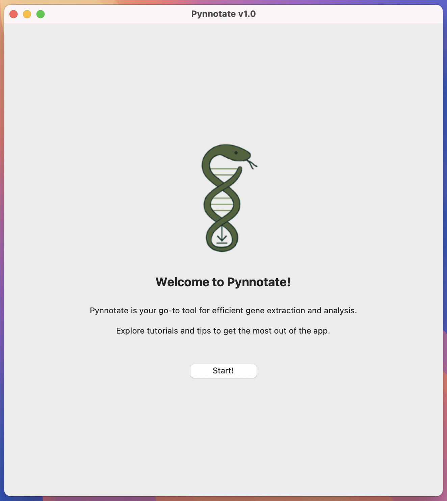

# 🧬 Pynnotate

**Pynnotate** é uma ferramenta gráfica (GUI) em Python para busca, download e anotação automática de sequências genéticas no GenBank.
Desenvolvido tanto para pesquisadores avançados quanto para professores e alunos iniciantes em bioinformática, filogenia e genética molecular, pynnotate oferece uma interface amigável que não exige conhecimento prévio em programação.


[](https://opensource.org/licenses/MIT)


1.  [✨ Funcionalidades](#-funcionalidades)
2.  [🖼️ Interface](#%EF%B8%8F-interface)
3.  [🛠️ Requisitos](#-requisitos)
4.  [💾 Instalação](#-instalação)
5.  [🧪 Exemplo de uso](#-exemplo-de-uso-versão-terminal)
6.  [⚙️ Detalhes dos Argumentos](%EF%B8%8F-detalhes-dos-argumentos)
7.  [🧾 Arquivos gerados](#-arquivos-gerados)
8.  [🤝 Contribuição](#-contribuição)
9.  [📣 Citação](#-citação)


---


## 👥 Autores

**Fernanda de Souza Caron**  
Pesquisadora de doutorado, PPG Ecologia e Conservação (UFPR)

**Felipe de Medeiros Magalhães**  
Pesquisador Pós-doc, Universidade Federal da Paraíba (UFPB)  

**Matheus Salles**  
Pesquisador de doutorado, PPG Zoologia (UFPR)

**Fabricius M. C. B. Domingos**  
Pesquisador e professor, PPG Zoologia (UFPR)


---


## ✨ Funcionalidades

- 🔍 Busca simples por termos livres ou IDs específicos no GenBank
- 🧠 Extração automática de genes com agrupamento por sinônimos
- ✂️ Filtros por tamanho da sequência e opções para priorizar amostras, ideal para diferentes níveis de análise
- Modos de filtragem adaptados:  
  🌐 Modo irrestrito: inclui todas as sequências encontradas  
  🌱 Modo flexível (unique_species = True): permite múltiplas sequências por espécie se genes forem diferentes  
  🔒 Modo estrito (prioritize_more_genes = True): inclui apenas a melhor sequência por espécie, facilitando análises simples  
- 🧬 Suporte para mitogenomas, cloroplastos e genomas nucleares
- 👓 Identificação automática de múltiplas cópias de tRNA-Leu e tRNA-Ser, com agrupamento por posição genômica
- 🖼️ Interface gráfica intuitiva para configuração, execução e acompanhamento dos processos sem necessidade de linha de comando
- 📂 Geração completa de arquivos FASTA, planilhas Excel e logs detalhados, prontos para uso em aulas ou pesquisas


---


## 🖼️ Interface




---

## 💾 Instalação

### Versão terminal

A versão terminal do Pynnotate é recomendada para usuários que preferem usar a ferramenta via prompt de comando ou integrar em pipelines automatizados.

1. Clone o repositório do GitHub:

```bash
git clone https://github.com/fernandacaron/pynnotate.git
cd pynnotate
pip install .
```

> Requisitos: Python 3.8+

2. Execute o programa no terminal com:

```bash
python pynnotate.py --help
```

### Versão gráfica (GUI)

Para facilitar o uso, disponibilizamos uma versão gráfica pronta para uso, empacotada em um arquivo .app para os principais sistemas operacionais.

1. Acesse a página de Releases no GitHub
2. Baixe o instalador correspondente ao seu sistema
3. Instale/descompacte o arquivo e execute o programa clicando no ícone
4. A interface gráfica abrirá, permitindo configurar e executar todas as funções do programa sem usar o terminal

---

## 🧪 Exemplo de uso

### Versão gráfica

1. Defina um gene (ex: COI) e um organismo (ex: Anura)
2. Clique em "💾 Search and download sequences"
3. O programa irá buscar, baixar e extrair os dados automaticamente
4. Veja os arquivos gerados no local escolhido

### Versão terminal

O Pynnotate utiliza um arquivo de configuração em formato YAML para facilitar a configuração das opções. Um arquivo de exemplo está disponível na pasta examples/ do repositório, chamado config.yaml.

Executando com o arquivo YAML:

```bash
python pynnotate.py -c examples/config.yaml
```

#### Notas importantes:

O arquivo YAML agrupa todas as configurações, evitando a necessidade de múltiplos argumentos na linha de comando.

Certifique-se de que os caminhos dos arquivos no YAML estejam corretos.

Para ver todas as opções e suas descrições, execute:

```bash
python pynnotate.py -h
```

---

## ⚙️ Detalhes dos Argumentos

Pynnotate é uma ferramenta de linha de comando que aceita vários argumentos para personalizar a busca, download e extração de sequências do GenBank. Abaixo está a descrição detalhada de cada argumento disponível no código atual.

#### **Argumentos obrigatórios**

##### `-c` ou `--config`

Descrição: Caminho para o arquivo de configuração YAML que contém todas as opções para rodar o Pynnotate.

> Nota: O arquivo YAML agrupa todas as configurações, facilitando o uso sem múltiplos argumentos na linha de comando. Um exemplo está disponível na pasta examples/.

#### **Argumentos obrigatórios no arquivo YAML**

Para rodar o Pynnotate corretamente via terminal, é necessário fornecer um arquivo de configuração YAML com pelo menos os seguintes campos obrigatórios:

##### `-e` ou `--email`

Descrição: Seu e-mail válido, exigido pelo NCBI Entrez para identificação e acesso ao GenBank.

##### `-o` ou `--output`

Descrição: Diretório onde os arquivos de saída serão salvos (nome da pasta também pode ser provido com argumento `--folder`, mas não é obrigatório). 

##### `-t` ou `--type`

Descrição: Tipo de genoma/organismo para determinar dicionário de sinônimos. Valores aceitos: *animal_mito, plant_mito, plant_chloro, other*.

##### `--filter-mode`

Descrição: Define como as sequências serão filtradas por espécie. Este parâmetro é essencial para controlar a redundância e a estrutura do seu conjunto de dados.

**Valores aceitos:**

🌐 Unconstrained: Inclui todas as sequências disponíveis, independentemente da redundância. Útil quando você deseja explorar ou curar manualmente todos os registros.

🌱 Flexible: Permite múltiplas sequências por espécie somente se cada nova sequência adicionar genes diferentes (por exemplo, em análises de supermatrizes).

🔒 Strict: Inclui apenas uma sequência por espécie, priorizando aquela com o maior número de genes presentes no dicionário principal ou no dicionário fornecido pelo usuário.

**⚠️ ATENÇÃO**: No modo strict, o filtro considera os genes listados no dicionário de sinônimos padrão e/ou no dicionário fornecido pelo usuário.

**⚠️ ATENÇÃO**: Quando o modo unconstrained é usado em combinação com a extração de genes separadamente (`--extraction`), todas as sequências correspondentes aos genes selecionados serão baixadas, mesmo que haja múltiplos registros por espécie.

**🚨 Além destes, você deve incluir ou `--accession` ou algum termo de busca na query (`--genes`, `--organism`,  `--publication` ou `--additional`) para indicar a busca dos dados:**

##### `-a` ou `--accession` 

Descrição: Lista de IDs do GenBank (accessions) para baixar. Pode ser null se usar algum argumento da *query*.

> Nota: Use apenas se quiser buscar por IDs específicos em vez de usar uma query.

#### **Argumentos opcionais (configuração via YAML ou linha de comando)**

##### `-g` ou `--genes`

Descrição: Lista separada por vírugla dos genes para procurar e baixar (e.g., COI, CYTB, ATP6).

> Nota: Extrai só os genes listados, caso contrário extrai todos conhecidos.

##### `-organism`

Descrição: Organismos para procurar e baixar (e.g., espécies, família).

##### `-p` ou `--publication`

Descrição: Termo de publicação (e.g., título, autores, ano).

##### `--additional`

Descrição: Qualquer termo de busca adicional (e.g., NOT sp).

##### `--mitochondrialgene`

Descrição: Refinar termos de busca para "genes mitocondriais".

##### `--mitogenome`

Descrição: Refinar termos de busca para "mitogenomas".

##### `--chloroplast`

Descrição: Refinar termos de busca para "cloroplasto".

##### `--annotated`

Descrição: Excluir registros não-anotados.

##### `--header`

Descrição: Campos para cabeçalho das sequências (campos do GenBank).

##### `--genbankid`

Descrição: Incluir GenBank ID nos cabeçalhos fasta.

##### `--prioritize`

Descrição: Priorizar indivíduos com mais genes (válido para mitocondriais)

##### `--add_synonyms`

Descrição: Sinônimos adicionais de nomes de genes em formato JSON. O pynnotate já inclui um dicionário interno de sinônimos de nomes de genes para auxiliar na extração. Você pode fornecer sinônimos adicionais para genes não reconhecidos automaticamente. Recomendamos executar o programa primeiro para identificar quaisquer sinônimos de genes não reconhecidos. Adicione quaisquer sinônimos ausentes aqui para melhorar a correspondência.

**⚠️ ATENÇÃO**: Ao selecionar o tipo de genoma e adicionar sinônimos, eles serão incorporados ao dicionário interno para aquele tipo específico de genoma. No entanto, se o tipo de genoma selecionado for 'other', apenas os sinônimos fornecidos pelo usuário serão usados.

##### `--min_bp`

Descrição: Define o comprimento mínimo permitido para uma sequência para ser mantida.

##### `--max_bp`

Descrição: Define o comprimento máximo permitido para uma sequência para ser mantida.

##### `--extraction`

Descrição: Booleano. Se True, extrai todos os genes separadamente, agrupando diferentes indivíduos/espécies nos respactivos arquivos de cada gene.

##### `--overlap`

Descrição: Arrumar sobreposição entre genes extraídos.

##### `--logmissing`

Descrição: Gerar log de espécies faltantes por amostra (útil para mitogenomas).

##### `--folder`

Descrição: Nome do pasta para criar dentro da pasta de saída (será criada automaticamente com nome pré-definido se argumento não existir).

#### **Outras opções**

##### `-h` ou `--help`

Descrição: Mostra a ajuda com a lista completa dos argumentos e suas descrições.


---

## 🧾 Arquivos gerados

Após a execução, o Pynnotate cria automaticamente um conjunto de arquivos no diretório de saída especificado (`--output`). 

output_folder/  
├── sequences.fasta  
├── log.txt  
├── metadata.xlsx  
├── genes_matrix.xlsx  
└── genes/  
    ├── COI.fasta  
    ├── CYTB.fasta  
    └── ...  

1. *sequences.fasta*: Contêm as sequências extraídas sem separar por genes.
2. *log.txt*: Relatório da execução do programa, útil para depuração e rastreabilidade. Inclui informações sobre os registros processados, problemas encontrados e decisões tomadas durante a filtragem.
3. *metadata.xlsx*: Metadados contidos no GenBank de cada sequência extraída.
4. *genes_matrix.xlsx*: Matriz indicando presença e ausência de cada genes nos registros baixados, incluindo os números de acesso.
5. *genes.*: Pasta contendo as sequências separadas por genes.

---

## 🤝 Contribuição

Contribuições são bem-vindas! Este projeto é de código aberto e livre para fins acadêmicos. 

Para relatar bugs, solicitar recursos ou enviar melhorias, abra uma issue ou um pull request.

---

## 📣 Citação

Se você usar **pynnotate** em sua pesquisa, cite-o da seguinte forma:

```
Caron, F. S.*, Magalhães, F. M.*, Salles, M., & Domingos, F. M. B. C. (2025). pynnotate: a flexible tool for retrieving and processing GenBank data in molecular evolution research and education. GitHub: https://github.com/fernandacaron/pynnotate
```

---