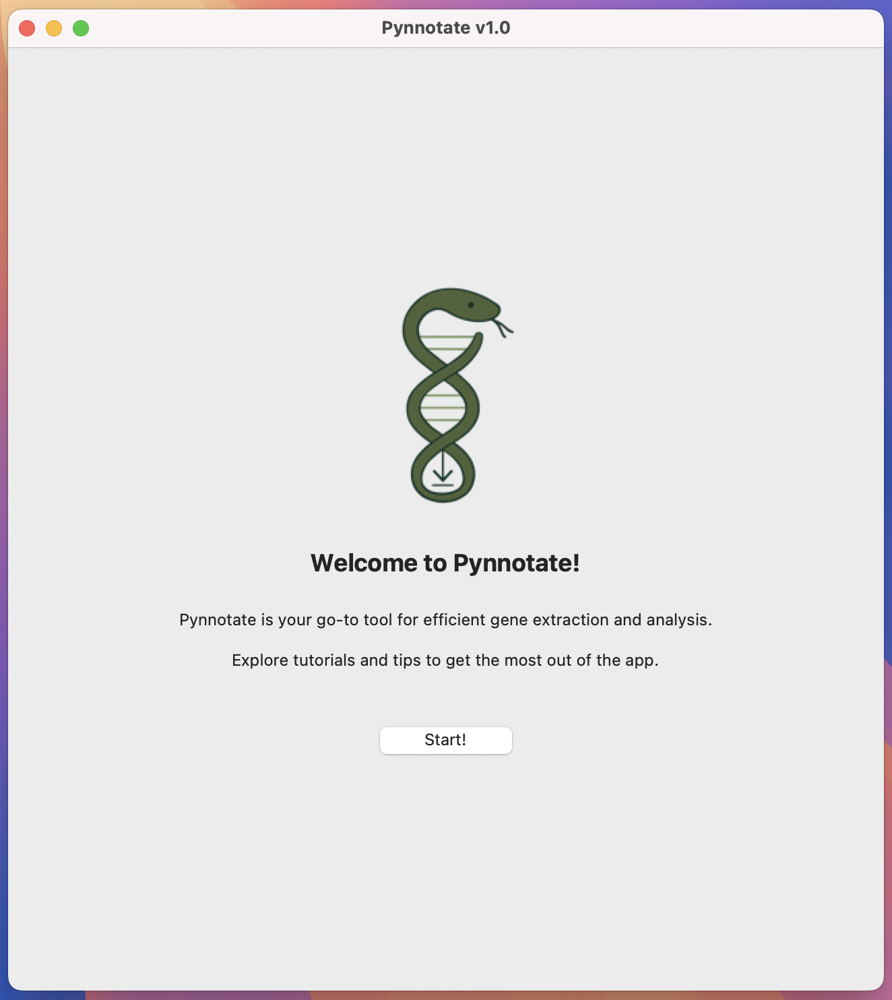

# 🧬 Pynnotate

[🇬🇧 English version](README.md)

**Pynnotate** é uma ferramenta gráfica (GUI) em Python para busca, download e anotação automática de sequências genéticas no GenBank. Desenvolvido tanto para pesquisadores avançados quanto para professores e alunos iniciantes em bioinformática, filogenia e genética molecular, *pynnotate* oferece uma interface amigável que não exige conhecimento prévio em programação.

  [](https://opensource.org/licenses/MIT)  


1.  [✨ Funcionalidades](#-funcionalidades)
2.  [💾 Instalação](#-instalação)
3.  [🧪 Exemplo de uso](#-exemplo-de-uso)
4.  [⚙️ Detalhes dos Argumentos](#%EF%B8%8F-detalhes-dos-argumentos)
5.  [🧾 Arquivos gerados](#-arquivos-gerados)
6.  [🤝 Ajuda](#-ajuda)
7.  [📣 Citação](#-citação)

---

## 👥 Autores

**Fernanda de Souza Caron**  
Universidade Federal do Paraná (UFPR)

**Felipe de Medeiros Magalhães**  
Universidade Federal da Paraíba (UFPB)  

**Matheus Salles**  
Universidade Federal do Paraná (UFPR)

**Fabricius M. C. B. Domingos**  
Universidade Federal do Paraná (UFPR)

--- 

## ✨ Funcionalidades

- 🔍 Busca simples por termos livres ou IDs específicos no GenBank
- 🧠 Extração automática de genes com agrupamento por sinônimos
- ✂️ Filtros por tamanho da sequência e opções para priorizar amostras, ideal para diferentes níveis de análise
- Modos de filtragem adaptados:  
  🌐 Modo irrestrito: inclui todas as sequências encontradas  
  🌱 Modo flexível (`unique_species = True`): permite múltiplas sequências por espécie se genes forem diferentes  
  🔒 Modo estrito (`prioritize_more_genes = True`): inclui apenas a sequência mais completa por espécie  
- 🧬 Suporte para mitogenomas, cloroplastos, genomas nucleares ou outras sequências especificadas pelo usuário
- 👓 Identificação automática de múltiplas cópias de tRNA-Leu e tRNA-Ser, com agrupamento por posição genômica
- 🖼️ Interface gráfica intuitiva para configuração, execução e acompanhamento dos processos sem necessidade de linha de comando
- 📂 Geração completa de arquivos FASTA, planilhas Excel e logs detalhados, prontos para uso em aulas ou pesquisas

---

## 💾 Instalação

### Versão terminal

A versão para terminal do *pynnotate* é recomendada para usuários que preferem executar a ferramenta via linha de comando ou integrá-la em pipelines automatizados. Esse método funciona no **Windows**, **macOS** e **Linux**.

> **Requisitos:**  
> - É necessário ter o Python **3.8 ou superior** instalado.  
> - Para verificar se o Python está instalado, execute:  
>   ```bash
>   python --version
>   ```
>   ou  
>   ```bash
>   python3 --version
>   ```
> - Se o Python **não** estiver instalado:  
>   - **Windows**: [Baixe do site python.org](https://www.python.org/downloads/windows/) e marque a opção “Add Python to PATH” durante a instalação.  
>   - **macOS**: Instale via [python.org](https://www.python.org/downloads/macos/) ou usando o Homebrew:  
>     ```bash
>     brew install python
>     ```
>   - **Linux**: Use o gerenciador de pacotes da sua distribuição, por exemplo:  
>     ```bash
>     sudo apt install python3 python3-pip
>     ```

1. Clone o repositório do GitHub:  

   Se tiver problemas com a autenticação via SSH, use a versão HTTPS abaixo (recomendada para a maioria dos usuários):

   **HTTPS (recomendado)**:
   ```bash
   git clone https://github.com/fernandacaron/pynnotate.git
   ```

   **SSH (para usuários com chave SSH configurada)**:
   ```bash
   git clone git@github.com:fernandacaron/pynnotate.git
   ```

2. Acesse a pasta do projeto:

   ```bash
   cd pynnotate
   ```

3. Instale o *pynnotate*:

  ```bash
  pip install -e .
  ```

4. Teste se o programa foi bem instalado:

   ```bash
   pynnotate --help
   ```

   Ou rode o exemplo com:

   ```bash
   pynnotate --config pynnotate/examples/config.yaml
   ```

### Versão gráfica (GUI)

Para facilitar o uso, disponibilizamos uma versão gráfica pronta para uso, compilada para os principais sistemas operacionais.

1. Acesse a página de [Releases](https://github.com/fernandacaron/pynnotate/releases) no GitHub
2. Baixe o instalador correspondente ao seu sistema
3. Instale/descompacte o arquivo e execute o programa clicando no ícone
4. A interface gráfica abrirá, permitindo configurar e executar todas as funções do programa sem usar o terminal

---

## 🧪 Exemplo de uso

### Versão gráfica

<p align="center">
   
</p>

1. Defina um gene (ex: COI) e um organismo (ex: Anura)
2. Clique em "💾 Search and download sequences"
3. O programa irá buscar, baixar e extrair os dados automaticamente
4. Veja os arquivos gerados no local escolhido

### Versão terminal

O Pynnotate utiliza um arquivo de configuração em formato YAML para facilitar a configuração das opções. Um arquivo de exemplo está disponível na pasta `examples/` do repositório, chamado `config.yaml`.

Executando com o arquivo YAML:

```bash
pynnotate --config pynnotate/examples/config.yaml
```

#### Notas importantes:

- O arquivo YAML agrupa todas as configurações, evitando a necessidade de múltiplos argumentos na linha de comando.
- Certifique-se de que os caminhos dos arquivos no YAML estejam corretos.
- Para ver todas as opções e suas descrições, execute:

```bash
pynnotate --help
```

---

## ⚙️ Detalhes dos Argumentos

*Pynnotate* é uma ferramenta de linha de comando que aceita vários argumentos para personalizar a busca, download e extração de sequências do GenBank. Abaixo está a descrição detalhada de cada argumento disponível no código atual.

#### **Argumentos obrigatórios**

##### `-c` ou `--config`

Descrição: Caminho para o arquivo de configuração YAML que contém todas as opções para rodar o *pynnotate*.

> Nota: O arquivo YAML agrupa todas as configurações, facilitando o uso sem múltiplos argumentos na linha de comando. Um exemplo está disponível na pasta `examples/`.

#### **Argumentos obrigatórios no arquivo YAML**

Para rodar o Pynnotate corretamente via terminal, é necessário fornecer um arquivo de configuração YAML com pelo menos os seguintes campos obrigatórios:

##### `-e` ou `--email`

Descrição: Seu e-mail válido, exigido pelo NCBI Entrez para identificação e acesso ao GenBank.

##### `-o` ou `--output`

Descrição: Diretório onde os arquivos de saída serão salvos (nome da pasta também pode ser provido com argumento `--folder`, mas não é obrigatório). 

##### `-t` ou `--type`

Descrição: Tipo de genoma/organismo para determinar dicionário de sinônimos. Valores aceitos: *animal_mito, plant_mito, plant_chloro, other*.

**⚠️ ATENÇÃO**: O tipo de genoma afeta a extração e filtragem de genes. Quando a extração está desabilitada, todas as sequências compatíveis com sua pesquisa serão baixadas, independente do tipo de genoma.

##### `-f` ou `--filter-mode`

Descrição: Define como as sequências serão filtradas por espécie. Este parâmetro é essencial para controlar a redundância e a estrutura do seu conjunto de dados.

**Valores aceitos:**

🌐 Unconstrained: Inclui todas as sequências disponíveis, independentemente da redundância. Útil quando você deseja explorar ou curar manualmente todos os registros.

🌱 Flexible: Permite múltiplas sequências por espécie somente se cada nova sequência adicionar genes diferentes (por exemplo, em análises de supermatrizes).

🔒 Strict: Inclui apenas uma sequência por espécie, priorizando aquela com o maior número de genes presentes no dicionário principal ou no dicionário fornecido pelo usuário.

**⚠️ ATENÇÃO**: No modo strict, o filtro considera os genes listados no dicionário de sinônimos padrão e/ou no dicionário fornecido pelo usuário.

**⚠️ ATENÇÃO**: Quando o modo unconstrained é usado em combinação com a extração de genes separadamente (`--extraction`), todas as sequências correspondentes aos genes selecionados serão baixadas, mesmo que haja múltiplos registros por espécie.

**🚨 Além destes, você deve incluir ou `--accession` ou algum termo de busca na query (`--genes`, `--organism`, `--publication` ou `--additional`) para indicar a busca dos dados.**

#### **Argumentos opcionais (configuração via YAML ou linha de comando)**

##### `--accession` 

Descrição: Lista de IDs do GenBank (accessions) para baixar. Pode ser null se usar algum argumento da *query*.

> Nota: Use apenas se quiser buscar por IDs específicos em vez de usar uma query.

##### `--genes`

Descrição: Lista separada por vírgula dos genes para procurar e baixar (e.g., COI, CYTB, ATP6).

> Nota: Extrai só os genes listados, caso contrário extrai todos conhecidos.

##### `-organism`

Descrição: Organismos para procurar e baixar (e.g., espécies, família).

##### `--publication`

Descrição: Termo de publicação (e.g., título, autores, ano).

##### `--additional`

Descrição: Qualquer termo de busca adicional (e.g., NOT sp).

##### `--mitochondrialgene`

Descrição: Booleano. Refinar termos de busca para "genes mitocondriais".

##### `--mitogenome`

Descrição: Booleano. Refinar termos de busca para "mitogenomas".

##### `--chloroplast`

Descrição: Booleano. Refinar termos de busca para "cloroplasto".

##### `--annotated`

Descrição: Booleano. Excluir registros não-anotados.

##### `--header`

Descrição: Campos para cabeçalho das sequências (campos do GenBank).

##### `--genbankid`

Descrição: Incluir GenBank ID nos cabeçalhos fasta.

##### `--prioritize`

Descrição: Booleano. Priorizar indivíduos com mais genes (válido para mitocondriais)

##### `--add_synonyms`

Descrição: Sinônimos adicionais de nomes de genes em formato JSON. O pynnotate já inclui um dicionário interno de sinônimos de nomes de genes para auxiliar na extração. Você pode fornecer sinônimos adicionais para genes não reconhecidos automaticamente. Recomendamos executar o programa primeiro para identificar quaisquer sinônimos de genes não reconhecidos. Adicione quaisquer sinônimos ausentes aqui para melhorar a correspondência.

**⚠️ ATENÇÃO**: Ao selecionar o tipo de genoma e adicionar sinônimos, eles serão incorporados ao dicionário interno para aquele tipo específico de genoma. No entanto, se o tipo de genoma selecionado for 'other', apenas os sinônimos fornecidos pelo usuário serão usados.

##### `--min_bp`

Descrição: Define o comprimento mínimo permitido para uma sequência para ser mantida.

##### `--max_bp`

Descrição: Define o comprimento máximo permitido para uma sequência para ser mantida.

##### `--extraction`

Descrição: Booleano. Se True, extrai todos os genes separadamente, agrupando diferentes indivíduos/espécies nos respectivos arquivos de cada gene.

**⚠️ ATENÇÃO**: A extração de genes será limitada ao dicionário de sinônimo selecionado. Por exemplo, selecionando 'plant_chloro', apenas genes de cloroplasto serão extraídos.

##### `--overlap`

Descrição: Booleano. Arrumar sobreposição entre genes extraídos.

##### `--logmissing`

Descrição: Booleano. Gerar log de espécies faltantes por amostra (útil para mitogenomas).

##### `--folder`

Descrição: Nome do pasta para criar dentro da pasta de saída (será criada automaticamente com nome pré-definido se argumento não existir).

#### **Outras opções**

##### `-h` ou `--help`

Descrição: Mostra a ajuda com a lista completa dos argumentos e suas descrições.

---

## 🧾 Arquivos gerados

Após a execução, o *pynnotate* cria automaticamente um conjunto de arquivos no diretório de saída especificado (`--output`). 

1. `sequences.fasta`: Contêm as sequências extraídas sem separar por genes.
2. `log.txt`: Relatório da execução do programa, útil para depuração e rastreabilidade. Inclui informações sobre os registros processados, problemas encontrados e decisões tomadas durante a filtragem.
3. `metadata.xlsx`: Metadados contidos no GenBank de cada sequência extraída.
4. `genes_matrix.xlsx`: Matriz indicando presença e ausência de cada genes nos registros baixados, incluindo os números de acesso.
5. `genes.`: Pasta contendo as sequências separadas por genes.

---

## 🤝 Ajuda

Este é um projeto open-source, gratuito para fins acadêmicos.

### 📝 Como reportar problemas ou fazer perguntas

Novo no GitHub? Não se preocupe! Siga este guia passo a passo:

1. Clique na aba **"Issues"** no topo desta página do repositório
2. Clique no botão verde **"New Issue"**
3. Escolha um template apropriado (se disponível) ou comece com uma issue em branco
4. **Título**: Seja claro e descritivo (ex: "Erro ao executar função X")
5. **Descrição**: Por favor, inclua:
   - O que você estava tentando fazer
   - O que realmente aconteceu (o erro/problema)
   - Passos para reproduzir o problema
   - Seu sistema operacional e versões dos softwares
   - Capturas de tela ou mensagens de erro (se aplicável)

### 🏷️ Usando labels

Ao criar uma issue, você pode adicionar labels como:

   - `bug` - para problemas ou erros
   - `enhancement` - para solicitações de recursos
   - `question` - para perguntas gerais
   - `help wanted` - se você precisa de assistência

---

## 📣 Citação

Se você usar ***pynnotate*** em sua pesquisa, cite-o da seguinte forma:

```
Caron, F. S.*, Magalhães, F. M.*, Salles, M., & Domingos, F. M. C. B. (2026). pynnotate: a flexible tool for retrieving and processing GenBank data in molecular evolution research and education [Preprint]. EcoEvoRxiv. https://doi.org/10.32942/X2294V

```
